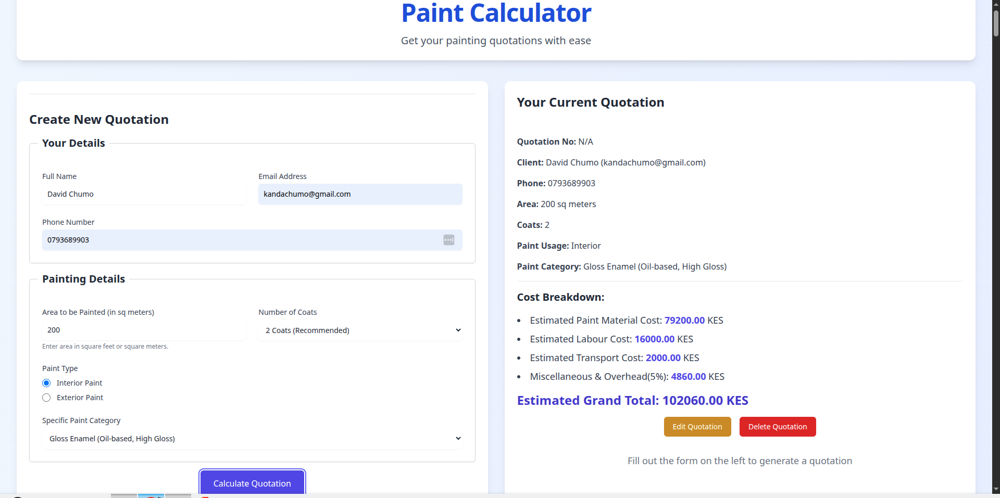

# The Paint Calculator

A practical web application for generating paint quotations, built with HTML, CSS (Tailwind CSS), and JavaScript, featuring a live backend.

By David Chumo

## Description

This application helps users easily calculate estimated costs for painting projects. It's designed to demonstrate key front-end development concepts, including form handling, dynamic calculations, DOM manipulation, and asynchronous data fetching. The application interacts with a live backend API  which uses **JSON Server** to manage the storage and retrieval of quotation history, providing a persistent and robust experience for users.

## Features

  * **User Details Input**: Collects essential client information like full name, email, and phone number.
  * **Painting Project Details**: Gathers critical project specifications including the area to be painted (in square meters), number of paint coats, paint type (interior/exterior), and specific paint category.
  * **Dynamic Cost Calculation**: Calculates estimated paint material cost, labor cost, transport cost, and miscellaneous/overhead expenses based on configurable rates fetched from a mock API.
  * **Detailed Quotation Output**: Displays a clear breakdown of all estimated costs and a grand total for the current quotation.
  * **Quotation History**: Stores and displays a list of all previously generated quotations, allowing users to review past estimates.
  * **Edit and Delete Quotations**: Users can easily edit existing quotations by pre-filling the form with saved data or delete quotations from the history.
  * **Responsive Design**: A clean, modern, and interactive user interface that adapts well to various screen sizes (desktop, tablet, and mobile) thanks to the utility-first approach of **Tailwind CSS**.
  * **Client-Side Logic**: All calculations and DOM updates happen seamlessly on the client-side, providing a smooth user experience without full page reloads.

## Screenshot



## How to Use

### Requirements

  * A computer with **Node.js** installed (for `npm` commands).
  * Access to the internet.
  * A modern web browser (e.g., Chrome, Firefox, Edge, Safari).
  * A code editor (VS Code recommended).
  * Terminal/Command Line.

### View Live Site

Visit the deployed application at: [The Paint Calculator](https://kandadave.github.io/paint_calculator/)

The live site allows you to:

  * Generate new paint quotations.
  * View details of any past quotation.
  * Edit and delete existing quotations.

### Local Development

If you want to run the project locally, follow these steps:

#### Installation Process

1.  **Clone this repository** using:

    ```bash
    git clone https://github.com/kandadave/paint_calculator 
    ```

    or by downloading a ZIP file of the code.

2.  **Navigate to the project directory**:

    ```bash
    cd paint_calculator 
    ```

3.  **Install JSON Server**: This will act as your mock backend API.

    ```bash
    npm install -g json-server@0.17.4
    ```

4.  **Install Live Server**: This will serve your frontend files.

    ```bash
    npm install -g live-server
    ```

5.  **Start the Backend (JSON Server)**: Open your terminal in the project directory and run:

    ```bash
    json-server db.json
    ```

    This will start the mock API, usually accessible at `http://localhost:3000`. Keep this terminal window open.

6.  **Start the Frontend (Live Server)**: Open a **new** terminal window in the project directory and run:

    ```bash
    live-server
    ```

    Your default web browser should automatically open the `index.html` file, typically at `http://127.0.0.1:8080` or `http://localhost:8080`.
    Alternatively, if you use VS Code, you can install the "Live Server" extension and click "Go Live" from the bottom bar while `index.html` is open.

## Technologies Used

  * **HTML5**: For structuring the web content.
  * **CSS3**: For styling and creating the appealing, responsive layout, primarily using **Tailwind CSS**.
  * **JavaScript (ES6+)**: For all interactive functionalities, DOM manipulation, form handling, and asynchronous operations (using `Fetch API` with Promises) to interact with the mock backend.
  * **JSON Server**: The application uses a JSON Server to provide lightweight REST API for supplying the rates and managing quotation data. This server is hosted on Render.com, offering persistence for out `db.json` file.

## Support and Contact Details

If you have any questions, suggestions, or need assistance, please contact:

Email: david.chumo@student.moringaschool.com

## License

```
MIT License

Copyright © 2025 David Chumo

Permission is hereby granted, free of charge, to any person obtaining a copy
of this software and associated documentation files (the "Software"), to deal
in the Software without restriction, including without limitation the rights
to use, copy, modify, merge, publish, distribute, sublicense, and/or sell
copies of the Software, and to permit persons to whom the Software is
furnished to do so, subject to the following conditions:

The above copyright notice and this permission notice shall be included in all
copies or substantial portions of the Software.

THE SOFTWARE IS PROVIDED "AS IS", WITHOUT WARRANTY OF ANY KIND, EXPRESS OR
IMPLIED, INCLUDING BUT NOT LIMITED TO THE WARRANTIES OF MERCHANTABILITY,
FITNESS FOR A PARTICULAR PURPOSE AND NONINFRINGEMENT. IN NO EVENT SHALL THE
AUTHORS OR COPYRIGHT HOLDERS BE LIABLE FOR ANY CLAIM, DAMAGES OR OTHER
LIABILITY, WHETHER IN AN ACTION OF CONTRACT, TORT OR OTHERWISE, ARISING FROM,
OUT OF OR IN CONNECTION WITH THE SOFTWARE OR THE USE OR OTHER DEALINGS IN THE
SOFTWARE.
```